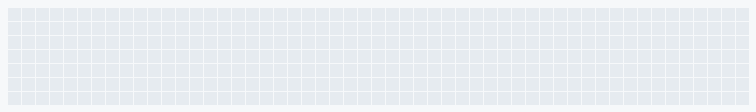

# 🛡️ Senior Cloud & Security Engineer (IAM | DevSecOps | AppSec)

I am a **Senior Cloud & Security Engineer** and **Blue Team Analyst** with over **9 years** of experience in architecting, engineering, and automating resilient cybersecurity programs across multi-cloud environments (Azure, GCP, AWS, OCI). My approach is focused on aligning robust security controls with business agility and measurable results.

---
 
### 🔭 I’m currently working on ...

* **Secure Data Engineering Pipeline:** Engineering end-to-end security and **Data Governance** for critical data pipelines, focusing on encryption, DLP (**Purview**), and robust **IAM** across data lakes.
* **AWS & CySA+ Roadmap:** Actively pursuing the **AWS Solutions Architect Associate** and **CompTIA CySA+** certifications to validate advanced cloud architecture and defensive security analysis skills.
* **AI-Powered Blue Team:** Building ML models and automation workflows for **proactive threat prioritization** and optimizing SOAR efficiency.
  
---

### 📊 My GitHub Stats

  

---

  

  

---

### 💻 Technologies and Tools

Aqui estão algumas das tecnologias com as quais tenho trabalhado:

  
  
  
  
  
  
  
  

---

### 🏆 Featured Certifications

                   

### 📫 How to find me

  

  

  

  

